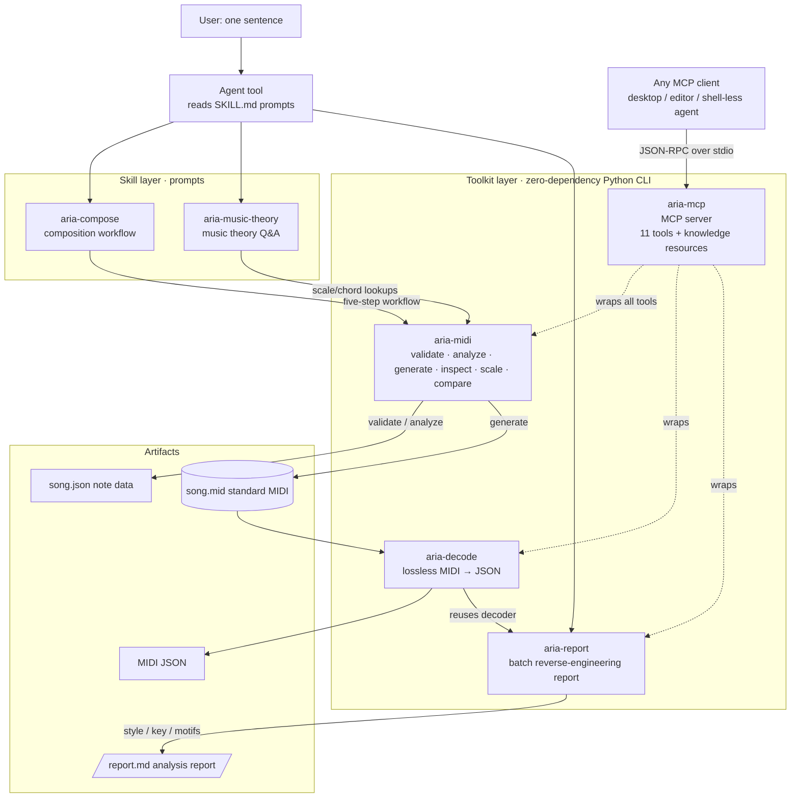

# Aria — Portable Music Skills Pack

> An AI music creation skill pack: **Skills (prompts) + Toolkit** in one package.
> Headless composition: no Node server, no LLM API calls.

[English](README.en.md) | [简体中文](README.md)

## Features

- **Natural-language composition**: say one sentence, and the Agent produces `song.json` + a standard MIDI file through a five-step workflow
- **Zero-dependency execution layer**: Python standard library only (Python 3.8+), callable directly from Bash by any Agent
- **JSON in/out + exit-code contract**: `0 success / 1 data error / 2 usage error`, results are programmatically testable
- **Quality loop**: `validate --strict` enforces 0 errors; `analyze` scores 0–10 with actionable Chinese suggestions — no release below the bar
- **Fully offline**: scale/chord lookups are computed by the built-in CLI, no network or external API required
- **Portable**: `install.py` deploys to `~/.agents` in one step for skills-scanning Agent tools

## Requirements

- Python 3.8+ (standard library only, no pip dependencies)
- Platforms: Windows / macOS / Linux (on Chinese Windows, track names default to GBK for player/DAW compatibility)

## Contents

```
.agent/
├── AGENTS.md              # Cross-tool entry facade (auto-discovered by AGENTS.md-aware tools)
├── README.md              # Chinese README
├── README.en.md           # English README (this file)
├── LICENSE                # MIT License
├── install.py             # Self-installer: deploys to ~/.agents for skills scanning
├── skills/
│   ├── aria-compose/       # Composition workflow: natural language → song.json → MIDI (pattern library / rules / examples)
│   │   └── references/    #   composition-rules / pattern-library / midi-schema / examples
│   └── aria-music-theory/  # Music theory Q&A: scales/chords/progressions + 5 style references (pop/EDM/jazz/tropical/techniques)
└── toolkits/
    ├── aria-midi/          # Zero-dependency Python CLI: generate/validate/inspect/scale/analyze/compare
    │   ├── aria_midi.py    #   v1.2.0 (analyze gained phrase-structure scoring)
    │   ├── README.md       #   Full CLI documentation
    │   ├── tests/          #   33 self-tests (roundtrip/validation/encoding/analysis/structure)
    │   └── bin/aria-midi.cmd    # PATH shim
    ├── aria-decode/        # Zero-dependency lossless MIDI → JSON decoder
    │   ├── aria_decode.py  #   v1.0.1, single file ~590 lines
    │   ├── README.md       #   Full decoder documentation
    │   ├── tests/          #   22 cases, 35 assertions
    │   └── bin/aria-decode.cmd  # PATH shim
    ├── aria-report/        # Zero-dependency batch MIDI reverse-engineering report
    │   ├── aria_report.py  #   v1.0.0 (depends on the sibling aria-decode)
    │   ├── README.md       #   Full documentation (analysis dimensions + known limits)
    │   ├── tests/          #   38 cases, 73 assertions
    │   └── bin/aria-report.cmd  # PATH shim
    └── aria-mcp/           # Zero-dependency MCP server (exposes Aria to any MCP client)
        ├── aria_mcp.py     #   v1.0.0, hand-rolled stdio JSON-RPC 2.0
        ├── README.md       #   Full documentation (incl. per-client config locations)
        ├── tests/          #   39 cases, 82 assertions
        └── bin/aria-mcp.cmd # PATH shim

> Every `bin/` ships both a Windows `.cmd` and a POSIX `sh` shim (extensionless, executable bit set).
```

## Architecture



Flow: one user sentence → the Agent drives the tools via skill prompts → the zero-dependency CLI computes in the toolkit layer → produces `song.json` and a standard MIDI file; `aria-decode` losslessly decodes any `.mid` back into JSON for reverse engineering / QA, and `aria-report` sits on top of that decode layer to batch-produce style/key/motif reports.

**Cross-agent reach**: `aria-mcp` wraps the three tools plus the knowledge base into an MCP server, so **any MCP-capable client** — including GUI agents with no shell and no prompt-reading — can use the full Aria capability set, not just agents that support skill scanning or command execution.

## Quick Start

```bash
# 1. Install to ~/.agents (auto-discovery for skills-scanning tools; idempotent, re-runnable)
python install.py

# 2. Use the CLI directly (zero installation)
python toolkits/aria-midi/aria_midi.py scale --root C4 --type major --list

# 3. Or add to PATH and use the short command
aria-midi generate --input song.json --output song.mid --bpm 120

# 4. Reverse-decode a MIDI file
aria-decode decode --input song.mid --output song.json
```

## CLI Subcommand Reference

| Subcommand | Purpose | Exit code |
|------------|---------|-----------|
| `validate --input song.json [--strict]` | Validate schema/range/velocity/quantization/overlap | 0 pass / 1 errors |
| `analyze --input song.json [--chords chords.json] [--key-root C4]` | Score 0–10 + improvement suggestions | 0 |
| `generate --input song.json --output song.mid [--bpm 120]` | Generate a standard MIDI file (Type-1, TPQN=480) | 0 / 1 / 2 |
| `inspect --input song.mid` | Parse a .mid back to JSON for self-check | 0 / 1 |
| `scale --root C4 --type major [--list/--chord/--snap/--suggest]` | Scale/chord lookups (13 scales, 14 chords) | 0 / 2 |

All subcommands take JSON in and produce JSON out; `--input -` reads from stdin; `aria-midi --version` shows the version.

## MIDI → JSON Decoding (aria-decode)

`aria-decode` answers "what is actually inside this `.mid`?" by losslessly decoding any MIDI file into structured JSON for reverse engineering, format conversion, and post-generation QA.

- **Every event**: meta / CC / pitch bend / lyrics / SysEx / system messages are kept, not just notes
- **Dual timing**: both PPQN and SMPTE (including 29.97 drop-frame) are supported
- **Exact time**: tempo changes are converted to seconds on a global timeline across tracks; notes include `start_time` / `end_time`
- **Readable mappings**: GM program names (128), standard CC controller names, and pitch names (C4 etc.)

```bash
aria-decode decode --input song.mid                      # full decode to stdout
aria-decode decode --input song.mid --output song.json   # full decode to a JSON file
aria-decode decode --input song.mid --no-events          # quick overview: header + global + notes
aria-decode decode --input song.mid --no-notes           # event details only
cat song.mid | aria-decode decode --input - > song.json  # stdin pipe
```

Unlike `aria-midi inspect` (lossy — extracts only notes/track names/tempo), aria-decode keeps every event. Prefer aria-decode when you need tempo changes, CC/pitch bend/lyrics, SysEx, or post-generation QA. See `toolkits/aria-decode/README.md` for the full command reference and output structure.

## Batch MIDI Reverse-Engineering (aria-report)

`aria-report` answers "I have one (or a pile of) human-arranged `.mid` files — what style are they, what key, and how does the melody develop?" It scans a directory, runs **style detection + key inference + melodic motif extraction** on each file, and emits a Markdown report (or JSON).

```bash
aria-report report --input decode/ --output report.md      # analyze the whole directory
aria-report report --input decode/foo.mid                  # analyze a single file
aria-report report --input decode/ --format json           # JSON output for programmatic use
```

Typical flow: drop `.mid` files into `decode/` → `aria-report report --input decode/` → get `report.md`. It reuses the aria-decode decoder and must be installed alongside it (see `toolkits/aria-report/README.md` for the full rule tables and known limits).

## Cross-Agent Reach: MCP Server (aria-mcp)

The three tools above are command-line programs, which implicitly require the agent to **be able to execute processes**. `aria-mcp` wraps them plus the knowledge base into an **MCP (Model Context Protocol) server**, so any MCP-capable client can use them — including GUI agents with no shell and no way to read prompts.

```bash
python toolkits/aria-mcp/aria_mcp.py            # stdio transport, launched by the MCP client
python toolkits/aria-mcp/aria_mcp.py --selftest # self-check
```

Register it in your client (`mcpServers` is the common key; the enclosing filename differs per client):

```json
{
  "mcpServers": {
    "aria": {
      "command": "python",
      "args": ["/absolute/path/Aria_Skills/toolkits/aria-mcp/aria_mcp.py"]
    }
  }
}
```

What it exposes:

- **11 tools**: `scale_list` / `chord_tones` / `snap_pitches` / `suggest_scale` / `validate_song` / `analyze_song` / `generate_midi` / `inspect_midi` / `decode_midi` / `compare_style` / `report_midi`
- **18 resources**: every Markdown under `skills/`, served as `aria://knowledge/<path>` for **on-demand fetching**, instead of injecting the whole ~43k-token knowledge base into context at once

Three design decisions worth knowing: **zero dependency** (hand-rolled stdio JSON-RPC 2.0, no official SDK, preserving "copy and run"), **content not paths** (MIDI travels as base64, since client and server may not share a filesystem), and **`isError` means the tool failed to run, not that the answer was negative** (a validation failure is a normal `ok:false` result — marking it as an error would hide the very error list the agent needs).

See `toolkits/aria-mcp/README.md` for per-client config locations and full details.

## Full Composition Workflow (see the five-step workflow in skills/aria-compose/SKILL.md)

```bash
aria-midi validate --input song.json --strict   # Step 1: must have 0 errors
aria-midi analyze  --input song.json --chords chords.json   # Step 2: score ≥ 7
aria-midi generate --input song.json --output song.mid      # Step 3: generate MIDI
aria-midi inspect  --input song.mid                         # Step 4: roundtrip self-check
```

Sample output (validate):

```json
{
  "ok": true,
  "errors": [],
  "warnings": [],
  "stats": {"bpm": 120, "track_count": 2, "note_count": 20, "total_beats": 32.0, "pitch_min": 36, "pitch_max": 74}
}
```

## How to Use the Skills

| Scenario | What to use |
|----------|-------------|
| Write/generate melodies, songs, MIDI, chord progressions | Read `skills/aria-compose/SKILL.md` and follow the five-step workflow |
| Music theory/arrangement Q&A | Read `skills/aria-music-theory/SKILL.md` |
| Reverse-engineer a MIDI you received | `aria-report report --input <file or dir>` (see `toolkits/aria-report/README.md`) |
| Agent has no shell / can't read prompts | Register the `aria-mcp` MCP server (see `toolkits/aria-mcp/README.md`) |
| CLI only, no prompts needed | Call directly per `toolkits/aria-midi/README.md` |

## Self-Test

```bash
python toolkits/aria-midi/tests/run_tests.py     # all 33 cases pass
python toolkits/aria-decode/tests/run_tests.py   # all 22 cases / 35 assertions pass
python toolkits/aria-report/tests/run_tests.py   # all 38 cases / 73 assertions pass
python toolkits/aria-mcp/tests/run_tests.py      # all 39 cases / 82 assertions pass
```

## FAQ

| Question | Answer |
|----------|--------|
| Track names garbled in Windows players? | `generate` defaults to `--name-encoding auto` — GBK on Chinese Windows, UTF-8 elsewhere; override with `--name-encoding` |
| Low `analyze` score? | Follow the suggestions in the output: chord tones on strong beats, velocity arcs, rhythmic breathing, rhythmic variety |
| Notes not on the 0.25 grid? | Non-strict `validate` only warns; add `--strict` to treat it as an error; start_beat/duration must be multiples of 0.25 |
| Multi-track analysis inaccurate? | Known limitation: `analyze` merges all tracks, including accompaniment; treat the melody track as the primary reference |
| Skill changes not taking effect? | This pack is packaged from `skills-source/`; edit the source files and repackage — do not edit this pack directly (except install.py) |

## License

This project is open-sourced under the **MIT License**. See [LICENSE](LICENSE).
Copyright (c) 2026 Mark7us

## Source of Truth

This pack is generated from `skills-source/` (via `package_to_agent.py`).
Edit skills in the source workspace and repackage; do not edit this pack directly (except install.py).
