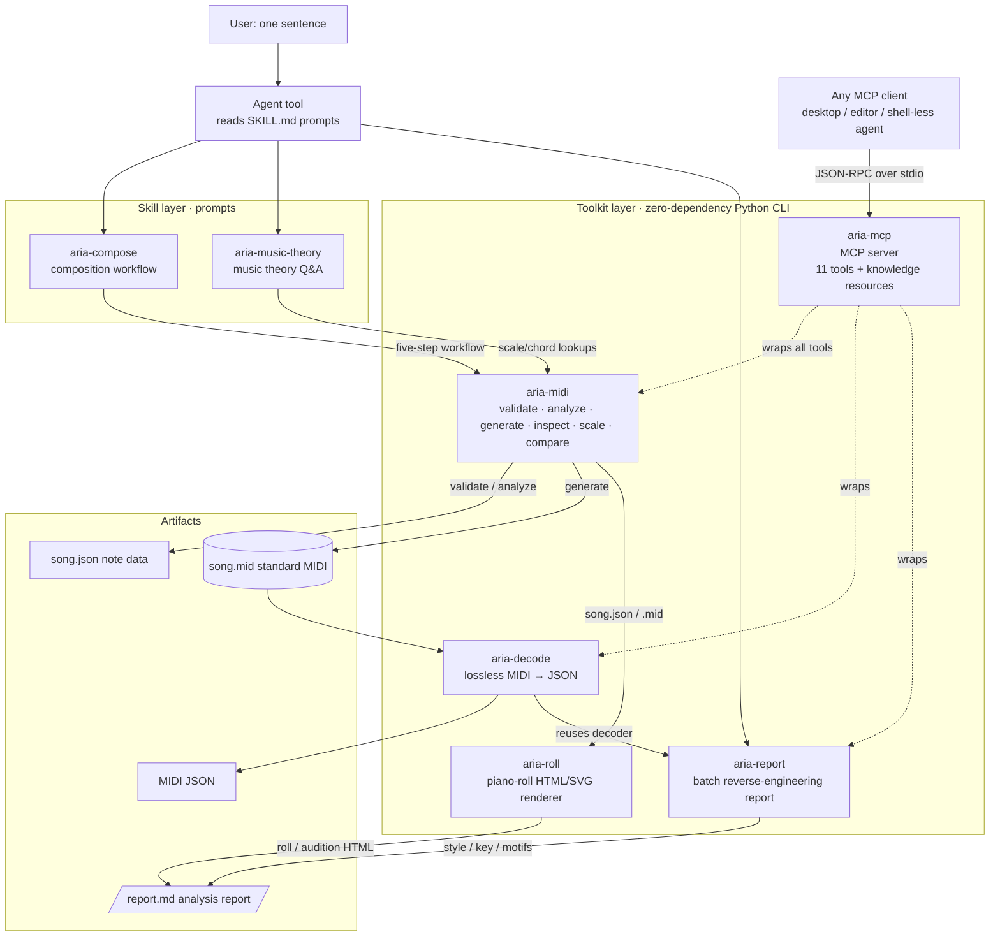

# Aria — A Portable Music Skill Pack

> A music capability pack for AI agents: **2 skills + 4 zero-dependency tools**.
> It lets a text-only coding agent compose music and dissect MIDI files — fully offline, no pip installs.

[简体中文](README.md) | [English](README.en.md)

## Features

- **Compose in natural language**: one sentence in, the agent follows a five-step workflow and produces `song.json` + a standard MIDI file
- **Zero-dependency execution layer**: Python standard library only (3.8+), callable from any agent with shell access
- **JSON in / JSON out with an exit-code contract**: `0 success / 1 data error / 2 usage error`, so results are programmatically checkable
- **Quality loop**: `validate --strict` enforces zero errors, `analyze` scores 0–10 and returns concrete suggestions — nothing ships below the bar
- **Cross-agent**: MCP-capable clients (including GUI agents with no shell) can call it directly; skill-scanning tools discover it automatically
- **See and hear it**: `aria-roll` renders the result into a self-contained HTML piano roll — open to view, press play to listen, no DAW or plugin needed
- **Fully offline**: scales and chords are computed by the bundled CLI, no network or external API
- **Optional web research**: when the style is unfamiliar or real-world examples are needed, it runs 2–3 rounds of fuzzy search in Chinese and English against no particular site, and only folds sources into the prompt after they clear a quality bar

## Requirements

- Python 3.8+
- Windows / macOS / Linux
- On Chinese Windows, track names default to GBK so players and DAWs display them correctly

## Quick Start

> The commands below run from the **package root**. Your song directories live wherever you work — they don't have to sit inside the package.

```bash
# Option 1: for skill-scanning agents — deploy to ~/.agents (idempotent, re-runnable)
python install.py

# Option 2: zero install, call the CLI directly
python toolkits/aria-midi/aria_midi.py scale --root C4 --type major --list

# Add toolkits/*/bin to PATH for short commands (.cmd on Windows, extensionless shim elsewhere)
aria-midi generate --input 未寄出的信/song.json
```

`install.py` deploys the two skills and four toolkits into `~/.agents/` without touching anything else there. Verify with `Test-Path ~/.agents/skills/aria-compose/SKILL.md` (PowerShell) or `ls ~/.agents/skills/aria-compose/SKILL.md`.

## Project Layout & Naming Convention

**One directory per song, with `name` at the top level of `song.json`.** Do not drop a fixed-name `song.json` into your project root — fixed names inevitably collide, and a few songs in you end up with a prefix free-for-all like `sad.song.json`, `wd222.song.json`.

```
<project>/
└── 未寄出的信/                  # directory name = the `name` inside song.json
    ├── song.json               # the score: {"name": "未寄出的信", "bpm": ..., "tracks": [...]}
    ├── chords.json             # chord progression (optional; lets analyze check strong-beat matching)
    ├── 未寄出的信.mid           # generated, filename derived from `name`
    ├── build_未寄出的信.py      # build script (for long pieces / repeated textures, see below)
    └── 未寄出的信.html          # self-contained player (if generated)
```

**Name it once, every path follows** — `generate`'s `--output` is optional and derives from the top-level `name`:

```bash
python toolkits/aria-midi/aria_midi.py generate --input 未寄出的信/song.json
#   → 未寄出的信/未寄出的信.mid
```

The song name is also written into the MIDI **sequence name** (meta `0x03`), so DAWs display it as the title. Precedence: `--output` > `--name` > top-level `name` > error (exit code 2). The derived directory defaults to the directory of `--input` and can be overridden with `--outdir`. Filenames are sanitized for `<>:"/\|?*`, control characters, and trailing dots/spaces (Windows silently truncates those), truncated to 60 characters, with CJK preserved as-is.

**Diagnostics are not persisted by default.** Read-back checks, event dumps, and decode results are all throwaway intermediates — in practice they accounted for 87% of the bytes produced while composing one piece. Prefer pipes:

```bash
python toolkits/aria-decode/aria_decode.py decode --input 未寄出的信/未寄出的信.mid --output -
python toolkits/aria-midi/aria_midi.py inspect --input 未寄出的信/未寄出的信.mid
```

When you do need to keep one, put it in the song directory as `<name>.qa.json` and note in your handoff that it is regenerable.

**Long pieces: use a build script, don't hand-write JSON.** Past roughly 16 bars, or whenever the accompaniment has repeated textures, write a `build_<name>.py` that emits `song.json`: repeated textures collapse into functions, a revision is one edit plus a re-run, and you can't accidentally break the 0.25-beat grid by hand. The script only serializes notes into `song.json` — it does **no** music theory (look scales and chords up with `aria-midi scale`), no validation, and no MIDI writing. All of that belongs to the toolchain. Short pieces can be hand-written directly.

## Composition Workflow

The full methodology lives in [`skills/aria-compose/SKILL.md`](skills/aria-compose/SKILL.md) (five-step workflow, seven composition rules, pattern library).

> The commands below run from the **package root** (`toolkits/...` is package-relative). `未寄出的信/` is your song directory — keep it wherever you work and substitute the real path.

```bash
# 1. Look up scales and chords with the CLI — never do the theory in your head
python toolkits/aria-midi/aria_midi.py scale --root A4 --type minor --list
python toolkits/aria-midi/aria_midi.py scale --root G4 --type major --chord dom7

# 2. Write 未寄出的信/song.json and 未寄出的信/chords.json
#    Schema: skills/aria-compose/references/midi-schema.md

# 3. Strict validation: must be ok=true with errors=[]
python toolkits/aria-midi/aria_midi.py validate --input 未寄出的信/song.json --strict

# 4. Quality score: proceed only when score >= 7 and passed=true;
#    otherwise fix per the suggestions and re-run step 3
python toolkits/aria-midi/aria_midi.py analyze \
    --input 未寄出的信/song.json --chords 未寄出的信/chords.json --key-root D4

# 5. Generate MIDI (--output optional, derived from the top-level name)
python toolkits/aria-midi/aria_midi.py generate --input 未寄出的信/song.json

# 6. Read back and verify note count / BPM / duration
python toolkits/aria-midi/aria_midi.py inspect --input 未寄出的信/未寄出的信.mid
```

Re-run `validate --strict` after **every** edit to `song.json` — never change the file without validating it.

**Release criteria**: `score >= 7` and `passed=true` (both technical and musicality sub-scores at ≥6); `structure_score >= 6` checks phrase segmentation, contour reuse, climax placement, and cadential stability. Leap-heavy styles (jazz / arpeggio / blues / EDM / lo-fi) should pass `--style jazz` etc. to explicitly waive the stepwise-motion constraint.

## Tools

All four depend only on the standard library, take JSON in and produce JSON out, and share the same exit-code contract. What differs is scope:

### aria-midi — the composition spine

`generate` / `validate` / `inspect` / `scale` / `analyze` / `compare`. **All music math lives here** (13 scale types, 14 chord types, scoring, MIDI encode/decode) — don't compute any of it by hand.

The workhorses are `scale --chord` for chord tones, `validate --strict` to enforce the grid and ranges, and `analyze` for a score plus concrete suggestions.

### aria-decode — lossless MIDI → JSON

Decodes any `.mid` **losslessly** into structured JSON that reverse engineering, format conversion, and post-generation QA can consume directly.

- **Every event**: meta / CC / pitch bend / lyrics / SysEx / system messages all preserved
- **Both time bases**: PPQN and SMPTE (including 29.97 drop-frame)
- **Accurate timing**: tempo changes are resolved across tracks on a global timeline into seconds

The difference from `aria-midi inspect` (lossy — notes, track names and tempo only): **use aria-decode when you need tempo changes, CC, pitch bend, lyrics, or SysEx.**

```bash
python toolkits/aria-decode/aria_decode.py decode --input x.mid --output -       # full decode to stdout
python toolkits/aria-decode/aria_decode.py decode --input x.mid --no-events      # overview: header + global + notes
python toolkits/aria-decode/aria_decode.py decode --input x.mid --no-notes       # event details only
```

### aria-report — batch MIDI reverse engineering

Scans a directory and runs **style detection + key inference + melodic motif analysis** on every `.mid`, emitting a Markdown or JSON report. Built for "I got a human-arranged MIDI — what style is it, and how does the melody develop?"

```bash
python toolkits/aria-report/aria_report.py report --input decode/ --output report.md
python toolkits/aria-report/aria_report.py report --input decode/foo.mid          # single file
python toolkits/aria-report/aria_report.py report --input decode/ --format json   # for programs
```

**Known limitation**: the melody track is chosen as the one with the highest average pitch. If a single track packs bass, chords, and melody together (common in exported files), the extracted "motifs" will be artifacts of cross-voice leaps. Split the voices with `aria-decode` first, or use a multi-track MIDI. The full rule tables are in `toolkits/aria-report/README.md`.

### aria-roll — piano-roll renderer (see it, hear it)

**MIDI is a score, not sound.** Aria's whole pipeline is symbolic, so a human who wants to see or hear the result has to drag it into a DAW, load a plugin and re-import — a pointless round trip whose return leg is broken. `aria-roll` removes it: render `song.json` **or any `.mid`** (including someone else's arrangement) into **one self-contained HTML** — open it for a Canvas piano roll, press play to hear it synthesized live via Web Audio. No DAW, no plugin, no soundfont.

```bash
python toolkits/aria-roll/aria_roll.py roll --input 未寄出的信/song.json   # → 未寄出的信/未寄出的信.html
python toolkits/aria-roll/aria_roll.py roll --input "Wait Day.mid"        # inspect someone else's MIDI
python toolkits/aria-roll/aria_roll.py roll --input song.json --format svg # static roll for vision-capable agents
```

Voices are synthesized per GM program family, the drum channel is drawn in neutral grey, legend entries are click-to-solo, space toggles playback. Audio is computed in the browser, so the file carries **no audio** (just the score plus a synth) — around 21 KB for a 600-note piece. See `toolkits/aria-roll/README.md`.

### aria-mcp — MCP server

The three tools above are command-line programs, which implicitly require the agent to **be able to execute processes**. `aria-mcp` wraps them plus the knowledge base into an [MCP](https://modelcontextprotocol.io) server, so any MCP-capable client can call them — **including GUI agents with no shell and no way to read prompts**.

- **11 tools**: `scale_list` / `chord_tones` / `snap_pitches` / `suggest_scale` / `validate_song` / `analyze_song` / `generate_midi` / `inspect_midi` / `decode_midi` / `compare_style` / `report_midi`
- **18 resources**: every Markdown under `skills/`, served as `aria://knowledge/<path>` for **on-demand fetching**, instead of injecting the whole ~43k-token knowledge base into context at once

Three design decisions: **zero dependency** (hand-rolled stdio JSON-RPC 2.0 with no official SDK, preserving "copy and run"), **content not paths** (MIDI travels as base64, since client and server may not share a filesystem), and **`isError` means the tool failed to run, not that the answer was negative** (a validation failure is a normal `ok:false` result — marking it as an error would hide the very error list the agent needs).

```bash
python toolkits/aria-mcp/aria_mcp.py --selftest   # self-check
```

## Four Ways to Connect an Agent

| Method | Best for | How |
|--------|----------|-----|
| **MCP** | Widest reach — **recommended** | Register `aria-mcp` as a stdio MCP server. Needs neither a shell nor prompt-reading |
| **Skill scanning** | ZCode / Claude Code and similar | `python install.py` deploys to `~/.agents/`, discovered at startup |
| **Explicit load** | Any agent | Have the agent read a `SKILL.md`: composing → `skills/aria-compose/SKILL.md`; theory → `skills/aria-music-theory/SKILL.md` |
| **CLI only** | No prompts needed | Call the commands directly per each toolkit's README |

**MCP registration** (`mcpServers` is the common key; the enclosing filename differs per client):

```json
{
  "mcpServers": {
    "aria": {
      "command": "python",
      "args": ["/absolute/path/Aria_Skills/toolkits/aria-mcp/aria_mcp.py"]
    }
  }
}
```

Per-client config locations and full details: [`toolkits/aria-mcp/README.md`](toolkits/aria-mcp/README.md).

**CLI resolution order** (for agents): try the short command `aria-midi <subcommand>` on PATH first; if absent, use the package-relative form `python <package-root>/toolkits/aria-midi/aria_midi.py <subcommand>`; never guess the path — confirm it with `find toolkits -name aria_midi.py` first.

## CLI Reference

| Subcommand | Purpose | Exit codes |
|------------|---------|-----------|
| `aria-midi validate --input song.json [--strict]` | Check schema / ranges / velocity / quantization / overlaps | 0 pass / 1 errors |
| `aria-midi analyze --input song.json [--chords c.json] [--key-root C4] [--style edm]` | 0–10 score (technical / musicality / structure) + suggestions | 0 |
| `aria-midi generate --input song.json [--output x.mid] [--bpm 120] [--name 歌名] [--outdir dir]` | Write a standard MIDI file (Type-1, TPQN=480); `--output` optional | 0 / 1 / 2 |
| `aria-midi inspect --input x.mid` | Parse a `.mid` back (lossy) | 0 / 1 |
| `aria-midi scale --root C4 --type major [--list\|--chord maj7\|--snap\|--suggest]` | Scale / chord lookups and key inference | 0 / 2 |
| `aria-midi compare --input song.json --reference ref.mid` | Style anchoring: your output vs a reference case | 0 / 1 / 2 |
| `aria-decode decode --input x.mid [--output f.json] [--no-events\|--no-notes]` | Lossless MIDI → JSON | 0 / 1 / 2 |
| `aria-report report --input <dir or file.mid> [--output r.md] [--format md\|json]` | Batch reverse-engineering report | 0 / 1 / 2 |
| `aria-roll roll --input <song.json\|x.mid> [--output r.html] [--format html\|svg]` | Render a self-contained playable HTML piano roll or a static SVG | 0 / 1 / 2 |
| `aria-mcp` | MCP server (stdio), launched by the client | — |

**Conventions**: `--input -` reads from stdin; without `--output` the result goes to stdout as UTF-8; `--version` prints the version. If your Windows console shows mojibake, set `PYTHONIOENCODING=utf-8`.

**Exit codes**: `0` success / `1` data error (read `errors` / `warnings`, fix, re-run) / `2` usage or IO error (check arguments, paths, output directory).

`validate / analyze / generate` accept `--input -` for JSON, and `aria-decode` takes MIDI on stdin:

```bash
cat 未寄出的信/song.json | python toolkits/aria-midi/aria_midi.py validate --input - --strict
cat x.mid | python toolkits/aria-decode/aria_decode.py decode --input - --no-events
```

## Layout & Architecture

```
Aria_Skills/
├── AGENTS.md              # Cross-tool entry point (picked up by AGENTS.md-aware tools)
├── install.py             # Self-installer: deploys to ~/.agents for skill scanning
├── examples/midi/         # Real MIDI cases (Deep House / Tropical / Lo-fi) for `compare`
├── decode/                # Drop-in directory for MIDI to dissect (aria-report input)
├── skills/
│   ├── aria-compose/      # Composition workflow: natural language → song.json → MIDI
│   │   └── references/    #   composition-rules / pattern-library / melody-chord-writing / midi-schema / examples
│   └── aria-music-theory/ # Music theory Q&A: scales/chords/progressions + style references
└── toolkits/
    ├── aria-midi/         # Composition spine       v1.3.0  51 cases
    ├── aria-decode/       # Lossless MIDI → JSON    v1.0.1  22 cases, 35 assertions
    ├── aria-report/       # Batch RE report         v1.0.0  38 cases, 73 assertions
    ├── aria-roll/         # Piano-roll renderer (HTML/SVG)  v1.0.0  31 cases, 50 assertions
    └── aria-mcp/          # MCP server              v1.0.0  40 cases, 87 assertions
```

Every toolkit has the same shape: the main program + `README.md` (full docs) + `tests/run_tests.py` + `bin/` (PATH shims — `.cmd` on Windows, an extensionless POSIX script elsewhere).

**Dependencies**: `aria-report` needs the sibling `aria-decode`; `aria-mcp` needs the other three toolkits and the sibling `skills/` knowledge base. Deploy or copy the whole package — don't take one piece in isolation.



## FAQ

| Question | Answer |
|----------|--------|
| Track names garbled in a Windows player? | `generate` defaults to `--name-encoding auto`: GBK on Chinese Windows, UTF-8 elsewhere. Override with `--name-encoding` |
| Notes not on the 0.25 grid? | Non-strict `validate` only warns; `--strict` treats it as an error. `start_beat` / `duration` must be multiples of 0.25 |
| Low `analyze` score? | Follow the suggestions: chord tones on strong beats, stepwise ratio, velocity arcs, rhythmic breathing, duration variety |
| Is `analyze` accurate for multi-track pieces? | By default it scores only the melody track (highest average pitch) to keep accompaniment from polluting the result. Use `--track` to pick one, `--all-tracks` to merge them |
| A jazz or arpeggio melody is flagged for too many leaps? | Add `--style jazz` / `arpeggio` / `blues` / `edm` / `lofi` to waive the stepwise-motion constraint |
| `aria-midi: command not found` | `toolkits/aria-midi/bin` isn't on PATH. Use the full Python path, or add `bin` to PATH |
| `python` not found | Not installed, or not on PATH. Use the full interpreter path |
| `inspect` reports SMPTE unsupported | `aria-midi inspect` only handles PPQN; use `aria-decode decode` for the full timeline |
| Edited `SKILL.md` but nothing changed? | Skill-scanning tools need `python install.py` re-run to redeploy into `~/.agents` |

## Self-Test

```bash
python toolkits/aria-midi/tests/run_tests.py     # all 51 cases pass
python toolkits/aria-decode/tests/run_tests.py   # all 22 cases / 35 assertions pass
python toolkits/aria-report/tests/run_tests.py   # all 38 cases / 73 assertions pass
python toolkits/aria-roll/tests/run_tests.py     # all 31 cases / 50 assertions pass
python toolkits/aria-mcp/tests/run_tests.py      # all 40 cases / 87 assertions pass
```

## License

Released under the **MIT License** — see [LICENSE](LICENSE).
Copyright (c) 2026 Mark7us

---

This repository is the maintained version; edit it directly. It was originally packaged from the earlier `amr-*` lineage, which has since diverged — don't edit the old workspace.
