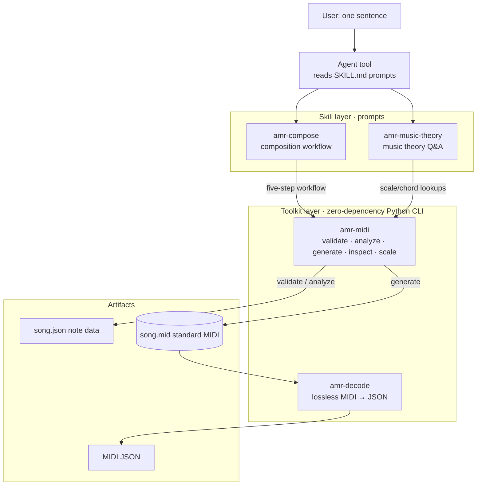

# AMIDI — Portable Music Skills Pack

> An AI music creation skill pack: **Skills (prompts) + Toolkit** in one package.
> Headless composition: no Node server, no LLM API calls.

[English](README.en.md) | [简体中文](README.md)

## Features

- **Natural-language composition**: say one sentence, and the Agent produces `song.json` + a standard MIDI file through a five-step workflow
- **Zero-dependency execution layer**: Python standard library only (Python 3.8+), callable directly from Bash by any Agent
- **JSON in/out + exit-code contract**: `0 success / 1 data error / 2 usage error`, results are programmatically testable
- **Quality loop**: `validate --strict` enforces 0 errors; `analyze` scores 0–10 with actionable Chinese suggestions — no release below the bar
- **Fully offline**: scale/chord lookups are computed by the built-in CLI, no network or external API required
- **Portable**: `install.py` deploys to `~/.agents` in one step for skills-scanning Agent tools

## Requirements

- Python 3.8+ (standard library only, no pip dependencies)
- Platforms: Windows / macOS / Linux (on Chinese Windows, track names default to GBK for player/DAW compatibility)

## Contents

```
.agent/
├── AGENTS.md              # Cross-tool entry facade (auto-discovered by AGENTS.md-aware tools)
├── README.md              # Chinese README
├── README.en.md           # English README (this file)
├── LICENSE                # MIT License
├── install.py             # Self-installer: deploys to ~/.agents for skills scanning
├── skills/
│   ├── amr-compose/       # Composition workflow: natural language → song.json → MIDI (pattern library / rules / examples)
│   │   └── references/    #   composition-rules / pattern-library / midi-schema / examples
│   └── amr-music-theory/  # Music theory Q&A: scales/chords/progressions + 5 style references (pop/EDM/jazz/tropical/techniques)
└── toolkits/
    ├── amr-midi/          # Zero-dependency Python CLI: generate/validate/inspect/scale/analyze
    │   ├── amr_midi.py    #   v1.1.0, single file ~865 lines
    │   ├── README.md      #   Full CLI documentation
    │   ├── tests/         #   23 self-tests (roundtrip/validation/encoding/analysis)
    │   └── bin/amr-midi.cmd   # PATH shim
    └── amr-decode/        # Zero-dependency lossless MIDI → JSON decoder
        ├── amr_decode.py  #   v1.0.0, single file ~575 lines
        ├── README.md      #   Full decoder documentation
        ├── tests/         #   20 cases, 32 assertions
        └── bin/amr-decode.cmd  # PATH shim
```

## Architecture



Flow: one user sentence → the Agent drives the tools via skill prompts → the zero-dependency CLI computes in the toolkit layer → produces `song.json` and a standard MIDI file; `amr-decode` losslessly decodes any `.mid` back into JSON for reverse engineering / QA.

## Quick Start

```bash
# 1. Install to ~/.agents (auto-discovery for skills-scanning tools; idempotent, re-runnable)
python install.py

# 2. Use the CLI directly (zero installation)
python toolkits/amr-midi/amr_midi.py scale --root C4 --type major --list

# 3. Or add to PATH and use the short command
amr-midi generate --input song.json --output song.mid --bpm 120
```

## CLI Subcommand Reference

| Subcommand | Purpose | Exit code |
|------------|---------|-----------|
| `validate --input song.json [--strict]` | Validate schema/range/velocity/quantization/overlap | 0 pass / 1 errors |
| `analyze --input song.json [--chords chords.json] [--key-root C4]` | Score 0–10 + improvement suggestions | 0 |
| `generate --input song.json --output song.mid [--bpm 120]` | Generate a standard MIDI file (Type-1, TPQN=480) | 0 / 1 / 2 |
| `inspect --input song.mid` | Parse a .mid back to JSON for self-check | 0 / 1 |
| `scale --root C4 --type major [--list/--chord/--snap/--suggest]` | Scale/chord lookups (13 scales, 14 chords) | 0 / 2 |

All subcommands take JSON in and produce JSON out; `--input -` reads from stdin; `amr-midi --version` shows the version.

## MIDI → JSON Decoding (amr-decode)

Losslessly decodes any `.mid`: every event type (meta / CC / pitch bend / lyrics / SysEx / system messages), PPQN and SMPTE timing, exact second timestamps across tempo changes, plus GM program names / CC controller names / pitch-name mapping.

```bash
amr-decode decode --input song.mid --output song.json   # full decode (default)
amr-decode decode --input song.mid --no-events          # quick overview: header + global + notes
```

Unlike `amr-midi inspect` (lossy — extracts only notes/track names/tempo), amr-decode keeps every event, ideal for reverse engineering, format conversion, and QA. See `toolkits/amr-decode/README.md`.

## Full Composition Workflow (see the five-step workflow in skills/amr-compose/SKILL.md)

```bash
amr-midi validate --input song.json --strict   # Step 1: must have 0 errors
amr-midi analyze  --input song.json --chords chords.json   # Step 2: score ≥ 7
amr-midi generate --input song.json --output song.mid      # Step 3: generate MIDI
amr-midi inspect  --input song.mid                         # Step 4: roundtrip self-check
```

Sample output (validate):

```json
{
  "ok": true,
  "errors": [],
  "warnings": [],
  "stats": {"bpm": 120, "track_count": 2, "note_count": 20, "total_beats": 32.0, "pitch_min": 36, "pitch_max": 74}
}
```

## How to Use the Skills

| Scenario | What to use |
|----------|-------------|
| Write/generate melodies, songs, MIDI, chord progressions | Read `skills/amr-compose/SKILL.md` and follow the five-step workflow |
| Music theory/arrangement Q&A | Read `skills/amr-music-theory/SKILL.md` |
| CLI only, no prompts needed | Call directly per `toolkits/amr-midi/README.md` |

## Self-Test

```bash
python toolkits/amr-midi/tests/run_tests.py    # all 23 cases pass
python toolkits/amr-decode/tests/run_tests.py  # all 20 cases / 32 assertions pass
```

## FAQ

| Question | Answer |
|----------|--------|
| Track names garbled in Windows players? | `generate` defaults to `--name-encoding auto` — GBK on Chinese Windows, UTF-8 elsewhere; override with `--name-encoding` |
| Low `analyze` score? | Follow the suggestions in the output: chord tones on strong beats, velocity arcs, rhythmic breathing, rhythmic variety |
| Notes not on the 0.25 grid? | Non-strict `validate` only warns; add `--strict` to treat it as an error; start_beat/duration must be multiples of 0.25 |
| Multi-track analysis inaccurate? | Known limitation: `analyze` merges all tracks, including accompaniment; treat the melody track as the primary reference |
| Skill changes not taking effect? | This pack is packaged from `skills-source/`; edit the source files and repackage — do not edit this pack directly (except install.py) |

## License

This project is open-sourced under the **MIT License**. See [LICENSE](LICENSE).
Copyright (c) 2026 Mark7us

## Source of Truth

This pack is generated from `skills-source/` (via `package_to_agent.py`).
Edit skills in the source workspace and repackage; do not edit this pack directly (except install.py).
