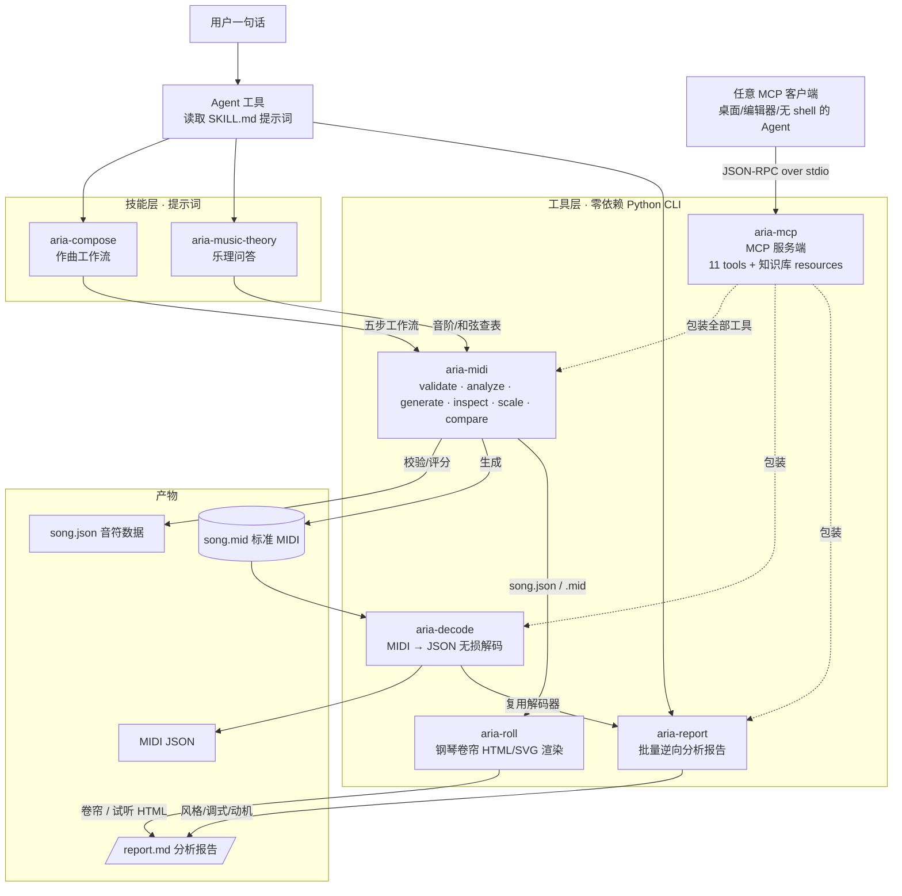

# Aria — 便携音乐技能包

> 给 AI Agent 用的音乐能力包：**2 个技能 + 5 个零依赖工具**。
> 让只会读写文本的编程 Agent 能作曲、能拆解 MIDI —— 全程离线，不装任何 pip 包。

[简体中文](README.md) | [English](README.en.md)

## 特性

- **自然语言作曲**：说一句话，Agent 按五步工作流产出 `song.json` + 标准 MIDI 文件
- **零依赖执行层**：仅 Python 标准库（Python 3.8+），任何 Agent 可用 shell 直接调用
- **JSON 进出 + 退出码契约**：`0 成功 / 1 数据错误 / 2 用法错误`，结果可编程判断
- **质量闭环**：`validate --strict` 是唯一硬闸（网格/音域/力度/重叠）；
  `analyze` 是**诊断不是闸门**（见「研究方向」），另可 `--baseline` 对照人写语料分位数
- **计划先行**：`plan_check.py` 在写音符之前检查八层计划，写完再查音符有没有把计划做出来
- **情感与线条检查**：`analyze` 额外给出**发声占比 / 音阶跑动均长 / 线条连续性 / 乐句终止音交替**
  —— 这四项是"有没有感情"的主要载体，比音高选择更能反映听感（见 `composition-rules.md` §3.5）
- **跨 Agent**：支持 MCP 的客户端（含无 shell 的 GUI Agent）可直接调用；支持 skills 扫描的工具可自动发现
- **看得见听得见**：`aria-roll` 把产物渲染成自包含 HTML 钢琴卷帘，双击即看、按播放即听 —— 不必再拉进 DAW 启插件
- **全流程离线**：音阶/和弦查表用内置 CLI 计算，不依赖网络与外部 API
- **联网增强**：风格未知或需要真实案例时，用中英文模糊检索 2–3 轮，不指定网站，来源过质量门槛后才落入提示词

## 研究方向：把检查从「音符表面」移到「结构决定」

本包最初想解决的是「让 Agent 写出好听的旋律」，做法是给 `analyze` 加指标、用分数卡质量。
三轮实测之后这条路被自己的数据否掉了，现在换了一条。

### 已放弃：用统计指标评测音乐质量

| 做法 | 实测结果 |
|---|---|
| 11 项指标打分，`score ≥ 7` 才放行 | **总分在音符层面没有梯度**：把一个旋律音在 ±7 半音内遍历 15 个候选，四拍恒 8.0、余温恒 9.0、未寄出的信恒 10.0——一分不动。零梯度 + 双值禁令 = 只能做约束满足 |
| 找「人机判别特征」区分好坏 | 两个曾 100% 分离的特征被真实名作打掉：密度线粗糙度 ← 《月光》通篇三连音（恒定是刻意写法）；附点占比 ← 实为 `if i%3==2` 的代码指纹 |
| 拿人类作品的分布当阈值 | 已知好作品本身就落在分布外：**Wait Day 在 6 项指标上超出人类 p05~p95**。按分布设闸，先毙掉的是好作品 |

结论与文献一致：MGEval 的作者把指标定位为「变异度指标」而非质量排名；2025 年 ACM 综述的原话是
「美学与艺术质量印象本质主观，因此很难、甚至不可能被客观逼近」。

### 现在：约束结构，把判断还给耳朵

| 层 | 管什么 | 工具 |
|---|---|---|
| **计划层** | 某个层级**有没有做决定**（曲式/调性/音区/织体/乐句目标/呼吸/骨架/动机） | `plan_check.py`，在写音符**之前** |
| **实现层** | 音符有没有把计划做出来（骨架音/目标音/高潮/呼吸点/音区带/动机首次陈述） | `plan_check.py --song` |
| **参照层** | 本曲在人写语料分位数里的落点（描述性，**不作判定**） | `analyze --baseline` |
| **裁判** | 好不好听 | 人耳，用 `aria-roll` 出可播放 HTML |

### 三条方法论纪律

1. **任何指标进门之前，先在真实人写语料上量误杀率。** 300 首 POP909 实测打回三处规则：
   「末句落主音」只有 29% 的真作品成立、「≥1/3 乐句有句内换气」37.7% 误杀、
   「和声去重」是把输入缺失当成了作品缺陷。修完六道门误杀率 0%。
2. **门只查「决定有没有做」，不查「决定做得好不好」。** 凡「统计位置／风格选择」类一律降为提示，
   并在文档里写明为什么不能当门——`plan-schema.md` 的门/提示对照表就是这么长出来的。
3. **被证伪的东西要留档。** `anti-formula.md` §5 记着 11 条已失效的特征与规则，
   防止后来者重新踩进去。

### 待验证

- **计划先行的收益尚未证明**：目前只有一首是严格「先写计划再写音符」走出来的
  （计划层 10/10、实现层 6/6），它与事后补计划作品的听感对比仍在进行。
- **各指标与人评的相关性**（Spearman）还没测过——这一步需要听测数据。

## 环境要求

- Python 3.8+
- Windows / macOS / Linux
- Windows 中文系统下音轨名默认 GBK 编码，与播放器/DAW 兼容

## 快速开始

> 以下命令在**包根目录**执行。歌曲目录是你自己的工作目录，不必放在包内。

```bash
# 方式一：支持 skills 扫描的 Agent —— 一键部署到 ~/.agents（幂等，可重复执行）
python install.py

# 方式二：零安装，直接用 CLI
python toolkits/aria-midi/aria_midi.py scale --root C4 --type major --list

# 把 toolkits/*/bin 加入 PATH 后也可用短命令（Windows 用 .cmd，其他平台用同名无扩展名垫片）
aria-midi generate --input 未寄出的信/song.json
```

`install.py` 会把两个技能与五个工具包部署到 `~/.agents/`，不影响该目录下的其他内容。部署后可用 `Test-Path ~/.agents/skills/aria-compose/SKILL.md`（PowerShell）或 `ls ~/.agents/skills/aria-compose/SKILL.md` 验证。

## 项目布局与命名约定

**每首歌一个目录，`song.json` 顶层写 `name`。** 不要往项目根目录直接写固定名的 `song.json` —— 固定名必然撞名，多首曲子会演变成 `sad.song.json`、`wd222.song.json` 这类前缀混战。

```
<项目>/
└── 未寄出的信/                  # 目录名 = song.json 顶层的 name
    ├── song.json               # 谱面：{"name": "未寄出的信", "bpm": ..., "tracks": [...]}
    ├── chords.json             # 和弦进行（可选，供 analyze 检查强拍匹配）
    ├── 未寄出的信.mid           # 生成物，由 name 自动派生
    ├── build_未寄出的信.py      # 生成脚本（长曲/重复织体时用，见下）
    └── 未寄出的信.html          # 自包含播放器（如已生成）
```

**命名一次，路径全自动** —— `generate` 的 `--output` 可省，由顶层 `name` 派生：

```bash
python toolkits/aria-midi/aria_midi.py generate --input 未寄出的信/song.json
#   → 未寄出的信/未寄出的信.mid
```

歌名同时写入 MIDI **序列名**（meta `0x03`），拖进 DAW 时显示为曲名。优先级：`--output` > `--name` > 顶层 `name` > 报错（退出码 2）。派生目录省略时取 `--input` 所在目录，可用 `--outdir` 覆盖。文件名会清洗 `<>:"/\|?*`、控制字符与结尾点/空格（Windows 会静默截断），超长截断到 60 字符，中文原样保留。

**诊断产物默认不落盘。** 回读核对、事件明细、解码结果都是看一眼就扔的中间物 —— 实测一次作曲过程中它们能占产出体积的 87%。优先用管道：

```bash
python toolkits/aria-decode/aria_decode.py decode --input 未寄出的信/未寄出的信.mid --output -
python toolkits/aria-midi/aria_midi.py inspect --input 未寄出的信/未寄出的信.mid
```

确实要留存时才写进歌曲目录、命名 `<歌名>.qa.json`，并在交付说明里标注可再生。

**长曲用生成脚本，不要手搓 JSON。** 超过约 16 小节、或伴奏有重复织体时，写一个 `build_<歌名>.py` 生成 `song.json`：重复织体压成函数、返修改一处重跑、不会手误写坏 0.25 网格。脚本只做「音符 → song.json」的序列化，**不做乐理计算**（音阶和弦一律用 `aria-midi scale` 查表）、不校验、不写 MIDI —— 那些都交给工具链。短曲直接手写 `song.json` 即可。

## 作曲工作流

完整方法论见 [`skills/aria-compose/SKILL.md`](skills/aria-compose/SKILL.md)（五步工作流 + 七大作曲规则 + 模式库）。

> 以下命令假设在**包根目录**执行（`toolkits/...` 是包内相对路径）。`未寄出的信/` 是你的歌曲目录，放在任何工作目录都行 —— 换成实际路径即可。

```bash
# 1. 查表：音阶和和弦一律用 CLI 算，不心算
python toolkits/aria-midi/aria_midi.py scale --root A4 --type minor --list
python toolkits/aria-midi/aria_midi.py scale --root G4 --type major --chord dom7

# 2. 先写八层计划 plan.json（曲式/和声/音区/织体/乐句四列/骨架/能量/动机）
#    字段与示例见 skills/aria-compose/references/plan-schema.md
#    人写作品里提取的可执行语法见 skills/aria-compose/references/human-grammar.md
python toolkits/aria-midi/plan_check.py --plan 未寄出的信/plan.json      # 计划层：门必须全过

# 3. 照着计划写 song.json 与 chords.json（schema 见 references/midi-schema.md）

# 4. 严格校验：必须 ok=true 且 errors=[]（唯一硬闸）
python toolkits/aria-midi/aria_midi.py validate --input 未寄出的信/song.json --strict

# 5. 查音符有没有把计划做出来（骨架音/目标音/高潮/呼吸点/音区带/动机）
python toolkits/aria-midi/plan_check.py --plan 未寄出的信/plan.json --song 未寄出的信/song.json

# 6. 诊断 + 对照人写语料分位数（--baseline 只作参照，不参与放行）
python toolkits/aria-midi/aria_midi.py analyze --input 未寄出的信/song.json --chords 未寄出的信/chords.json --key-root D4 --baseline

# 7. 生成 MIDI 与回读自检（--output 可省，由顶层 name 派生）
python toolkits/aria-midi/aria_midi.py generate --input 未寄出的信/song.json
python toolkits/aria-midi/aria_midi.py inspect --input 未寄出的信/未寄出的信.mid
```

每次修改 `song.json` 后必须重新执行 `validate --strict`，不能只改文件不校验。

**放行条件**：`validate --strict` 0 错误（唯一硬闸）+ `plan_check` 计划层与实现层的门全过 +
**人耳听过**。`analyze` 的分数**不参与放行**——它在音符层面没有梯度（见「研究方向」），
只用来看 `details`、`suggestions` 与 `--baseline` 的落点。
跳进型风格（爵士/琶音/蓝调/EDM/Lo-fi）可用 `--style jazz` 等显式豁免级进占比约束。

## 工具

五个工具都只依赖标准库，JSON 进 JSON 出，退出码契约一致。另有三个独立脚本（同在 aria-midi 内）：
`plan_check.py`（计划层检查，见「研究方向」）、`calibrate.py`（用人写语料标定分位数）、
`reference/human-baseline.json`（随包预置的标定结果，`analyze --baseline` 直接消费）。看差异与选用：

### aria-midi — 作曲主线

`generate` / `validate` / `inspect` / `scale` / `analyze` / `compare`。**所有音乐数学都用它**（13 种音阶、14 种和弦、评分、MIDI 编解码），不要心算。

最常用的是 `scale --chord` 查和弦音、`validate --strict` 卡网格与音域、`analyze` 拿评分和改进建议。

### aria-decode — MIDI → JSON 无损解码

把任意 `.mid` **无损**解码为结构化 JSON，逆向分析、格式转换、生成后质检都能直接消费。

- **完整事件**：meta / CC / 弯音 / 歌词 / SysEx / 系统消息全部保留
- **双时基**：PPQN 与 SMPTE（含 29.97 drop-frame）均支持
- **精确时间**：Tempo 变化按全局时间轴跨轨换算秒时间

与 `aria-midi inspect`（有损，只提取音符/音轨名/Tempo）的区别：**需要检查 Tempo 变化、CC、弯音、歌词、SysEx 时用 aria-decode**。

```bash
python toolkits/aria-decode/aria_decode.py decode --input x.mid --output -       # 完整解码到 stdout
python toolkits/aria-decode/aria_decode.py decode --input x.mid --no-events      # 概览：头部+全局+音符
python toolkits/aria-decode/aria_decode.py decode --input x.mid --no-notes       # 只要事件明细
```

### aria-roll — 钢琴卷帘渲染（看得见、听得见）

**MIDI 是谱，不是声音。** Aria 整条管线都是符号化的，人要看要听只能拉进 DAW 启插件再导入 —— 一个多余的往返，而且回程断路。`aria-roll` 消掉它：把 `song.json` **或任意 `.mid`**（含别人的编曲）渲染成**一个自包含 HTML**，双击就看到 Canvas 卷帘，按播放就听到 Web Audio 现场合成的声音 —— 不需要 DAW、插件或音源。

```bash
python toolkits/aria-roll/aria_roll.py roll --input 未寄出的信/song.json   # → 未寄出的信/未寄出的信.html
python toolkits/aria-roll/aria_roll.py roll --input "Wait Day.mid"        # 别人的 MIDI 也能直接看
python toolkits/aria-roll/aria_roll.py roll --input song.json --format svg # 静态卷帘，Agent 可读图
```

卷帘按 GM program 分族合成音色、打击乐通道用中性灰区分、图例可点独奏、空格播放/停止。声音在浏览器里实时算出，所以文件里**不塞音频**（只传谱 + 合成器），600 音符的曲子约 21 KB。详见 `toolkits/aria-roll/README.md`。

### aria-report — MIDI 批量逆向分析

扫描一个目录，对每个 `.mid` 做**风格识别 + 调式推测 + 旋律动机分析**，输出 Markdown 或 JSON 报告。适合「拿到人类编曲的 MIDI，想看清它是什么风格、动机怎么发展」。

```bash
python toolkits/aria-report/aria_report.py report --input decode/ --output report.md
python toolkits/aria-report/aria_report.py report --input decode/foo.mid          # 只分析单个
python toolkits/aria-report/aria_report.py report --input decode/ --format json   # 程序化消费
```

**已知限制**：旋律轨按「平均音高最高的轨」选取。若一个轨里混装了低音+和弦+旋律（很多导出文件如此），检出的「动机」会是跨声部大跳的假象。此时先用 `aria-decode` 拆声部或改用多轨 MIDI。完整规则表见 `toolkits/aria-report/README.md`。

### aria-mcp — MCP 服务端

上面三个都是命令行程序，隐含要求 Agent **能执行进程**。`aria-mcp` 把它们连同知识库包装成 [MCP](https://modelcontextprotocol.io) 服务端，使任何支持 MCP 的客户端都能调用 —— **包括没有 shell、也读不到提示词的 GUI 类 Agent**。

- **11 个 tools**：`scale_list` / `chord_tones` / `snap_pitches` / `suggest_scale` / `validate_song` / `analyze_song` / `generate_midi` / `inspect_midi` / `decode_midi` / `compare_style` / `report_midi`
- **18 个 resources**：`skills/` 下全部 Markdown，以 `aria://knowledge/<路径>` 供客户端**按需拉取**，避免把约 4.3 万 token 的知识库一次性注入上下文

三个设计决策：**零依赖**（手写 stdio JSON-RPC 2.0，不引官方 SDK，保住「复制即用」）、**传内容不传路径**（MIDI 一律 base64 进出，适配客户端与服务端不共享文件系统的场景）、**`isError` 只表示工具没跑成**（校验查出错误是正常结果 `ok:false`，不是工具崩溃 —— 否则 Agent 读不到它最需要的报错详情）。

```bash
python toolkits/aria-mcp/aria_mcp.py --selftest   # 自检
```

## 接入 Agent 的四种方式

| 方式 | 适用 | 做法 |
|------|------|------|
| **MCP** | 覆盖面最广，**推荐** | 把 `aria-mcp` 注册为 stdio MCP 服务端。不需要 shell，也不需要 Agent 读提示词 |
| **skills 扫描** | ZCode / Claude Code 等 | `python install.py` 部署到 `~/.agents/`，启动时自动发现 |
| **显式加载** | 任何 Agent | 让 Agent 读取 `SKILL.md`：作曲 → `skills/aria-compose/SKILL.md`；乐理 → `skills/aria-music-theory/SKILL.md` |
| **纯 CLI** | 不需要提示词 | 按各 toolkit 的 README 直接调命令 |

**MCP 注册**（`mcpServers` 为通用键，外层文件名各客户端不同）：

```json
{
  "mcpServers": {
    "aria": {
      "command": "python",
      "args": ["/绝对路径/Aria_Skills/toolkits/aria-mcp/aria_mcp.py"]
    }
  }
}
```

各客户端配置落点与完整说明见 [`toolkits/aria-mcp/README.md`](toolkits/aria-mcp/README.md)。

**CLI 定位顺序**（Agent 执行时）：先试 PATH 上的短命令 `aria-midi <子命令>`；不存在则用包内相对路径 `python <包根目录>/toolkits/aria-midi/aria_midi.py <子命令>`；不要猜路径，先 `find toolkits -name aria_midi.py` 确认实际位置。

## CLI 速查

| 子命令 | 功能 | 退出码 |
|--------|------|--------|
| `aria-midi validate --input song.json [--strict]` | 校验 schema / 音域 / 力度 / 量化 / 重叠 | 0 通过 / 1 有错误 |
| `aria-midi analyze --input song.json [--chords c.json] [--key-root C4] [--style edm]` | 0–10 评分（技术/音乐性/结构）+ 中文改进建议 | 0 |
| `aria-midi generate --input song.json [--output x.mid] [--bpm 120] [--name 歌名] [--outdir 目录]` | 生成标准 MIDI（Type-1, TPQN=480）；`--output` 可省 | 0 / 1 / 2 |
| `aria-midi inspect --input x.mid` | 解析回读 .mid 自检（有损） | 0 / 1 |
| `aria-midi scale --root C4 --type major [--list\|--chord maj7\|--snap\|--suggest]` | 音阶 / 和弦查表与调式推测 | 0 / 2 |
| `aria-midi compare --input song.json --reference ref.mid` | 风格锚定：产出 vs 参考案例参数对比 | 0 / 1 / 2 |
| `aria-decode decode --input x.mid [--output f.json] [--no-events\|--no-notes]` | 无损解码 MIDI → JSON | 0 / 1 / 2 |
| `aria-report report --input <目录或文件.mid> [--output r.md] [--format md\|json]` | 批量逆向分析报告 | 0 / 1 / 2 |
| `aria-roll roll --input <song.json\|x.mid> [--output r.html] [--format html\|svg] [--title T] [--zoom N]` | 渲染自包含 HTML 钢琴卷帘（可播放）或静态 SVG | 0 / 1 / 2 |
| `aria-mcp` | MCP 服务端（stdio），由客户端拉起 | — |

**通用约定**：`--input -` 从 stdin 读取；不传 `--output` 时写 stdout（UTF-8）；`--version` 查看版本。Windows 控制台若乱码，设 `PYTHONIOENCODING=utf-8`。

**退出码**：`0` 成功 / `1` 数据错误（读 `errors` / `warnings` 修正后重跑）/ `2` 用法或 IO 错误（检查参数、路径、输出目录）。

`validate / analyze / generate` 支持 `--input -` 读 JSON，`aria-decode` 的 `--input -` 读 MIDI：

```bash
cat 未寄出的信/song.json | python toolkits/aria-midi/aria_midi.py validate --input - --strict
cat x.mid | python toolkits/aria-decode/aria_decode.py decode --input - --no-events
```

## 目录结构与架构

```
Aria_Skills/
├── AGENTS.md              # 跨工具接入门面（支持 AGENTS.md 的工具自动发现）
├── install.py             # 自安装器：部署到 ~/.agents 供 skills 扫描
├── examples/midi/         # 真实 MIDI 案例（Deep House / Tropical / Lo-fi），供 compare 锚定
├── decode/                # 待拆解 MIDI 输入目录（aria-report 分析入口）
├── docs/                  # 分析报告：人机分析报告.md + measure.py（可复现测量脚本）
├── skills/
│   ├── aria-compose/      # 作曲工作流：自然语言 → song.json → MIDI
│   │   └── references/    #   plan-schema（八层计划 + 门/提示划分）/ human-grammar（人写语法九条）
│   │                      #   composition-rules（含 §3.5 情感线与线条）/ pattern-library / melody-chord-writing
│   │                      #   / anti-formula（含 §5 已证伪清单）/ midi-schema / examples / web-research-guide
│   └── aria-music-theory/ # 乐理问答：音阶/和弦/进行 + 风格知识库（pop/EDM/jazz/tropical/techniques/g-house）
└── toolkits/
    ├── aria-midi/         # 作曲主线 CLI + 计划检查 + 语料标定   v1.3.0  74 用例
    │   ├── plan_check.py  #   计划层检查（八层结构 + 计划/音符一致性 + --derive 反推）
    │   ├── calibrate.py   #   用人写语料标定指标分位数（零依赖，通用语料契约）
    │   └── reference/     #   human-baseline.json（POP909 300 首，随包预置）
    ├── aria-decode/       # MIDI → JSON 无损解码      v1.0.1  22 用例 35 断言
    ├── aria-report/       # 批量逆向分析报告          v1.0.0  38 用例 73 断言
    ├── aria-roll/         # 钢琴卷帘渲染（HTML/SVG）    v1.0.0  31 用例 50 断言
    └── aria-mcp/          # MCP 服务端                v1.0.0  40 用例 87 断言
```

每个 toolkit 目录结构一致：主程序 + `README.md`（完整文档）+ `tests/run_tests.py` + `bin/`（PATH 垫片，Windows 为 `.cmd`、POSIX 为同名无扩展名脚本）。

**依赖关系**：`aria-report` 依赖同级的 `aria-decode`；`aria-mcp` 依赖其余三个 toolkit 与同级的 `skills/` 知识库。部署或拷贝时请整包一起，不要单独取其中一个。



## 常见问题

| 问题 | 解答 |
|------|------|
| 生成的 MIDI 音轨名在 Windows 播放器里乱码？ | `generate` 默认 `--name-encoding auto`：Windows 中文系统用 GBK，其他平台用 UTF-8。可用 `--name-encoding` 覆盖 |
| 音符不在 0.25 网格上？ | `validate` 非 strict 只警告，加 `--strict` 视为错误。`start_beat` / `duration` 必须是 0.25 的整数倍 |
| `analyze` 分数低？ | 按 `suggestions` 里的中文建议改：强拍落和弦音、力度弧线、节奏呼吸、时值多样 |
| 分数不错但听着"没感情"？ | 看 `details` 的线条四项：`sounding_ratio` ≥0.8、`scalar_run_mean` ≤1.5、`continuity_points` ≥2.5、连奏率 ≥0.75。**分数只测"表达的参数"，线条才测"表达的组织"** |
| 旋律像音阶练习曲？ | `scalar_run_mean` 偏高（>1.5）。别为了「级进占比 ≥60%」把旋律写成音阶；人写名作是 1.01–1.30，改成邻音摆动/回返音型（`composition-rules.md` §3.5.3） |
| 琶音型旋律被判"旋律断裂、机器味明显"？ | 2026-09 起已修：跳进为主**且线条连续**会判为「属琶音/音型化写法——无需修改」。仍可用 `--style arpeggio` 显式豁免 |
| 多轨作品 `analyze` 评分准吗？ | 默认只评旋律轨（平均音高最高的轨），避免伴奏轨污染；用 `--track` 指定、`--all-tracks` 合并全轨 |
| 爵士 / 琶音旋律被误判跳进过多？ | 加 `--style jazz` / `arpeggio` / `blues` / `edm` / `lofi` 豁免级进占比约束 |
| `aria-midi` 不是内部或外部命令 | `toolkits/aria-midi/bin` 未加入 PATH。改用完整 Python 路径，或把 `bin` 加入 PATH |
| `python` 找不到 | 未安装或未加入 PATH。用完整解释器路径 |
| `inspect` 报 SMPTE 不支持 | `aria-midi inspect` 只支持 PPQN；改用 `aria-decode decode` 看完整时间轴 |
| 改了 `SKILL.md` 但不生效？ | skills 扫描类工具需重跑 `python install.py` 重新部署到 `~/.agents` |

## 自测

```bash
python toolkits/aria-midi/tests/run_tests.py     # 74 个用例全绿
python toolkits/aria-decode/tests/run_tests.py   # 22 个用例 35 项断言全绿
python toolkits/aria-report/tests/run_tests.py   # 38 个用例 73 项断言全绿
python toolkits/aria-roll/tests/run_tests.py     # 31 个用例 50 项断言全绿
python toolkits/aria-mcp/tests/run_tests.py      # 40 个用例 87 项断言全绿
```

## 开源许可

本项目基于 **MIT License** 开源，详见 [LICENSE](LICENSE)。
Copyright (c) 2026 Mark7us

---

本仓库即当前维护版本，直接在此修改。早期由 `amr-*` 谱系打包演化而来，两者已分叉，勿回改旧工作区。
