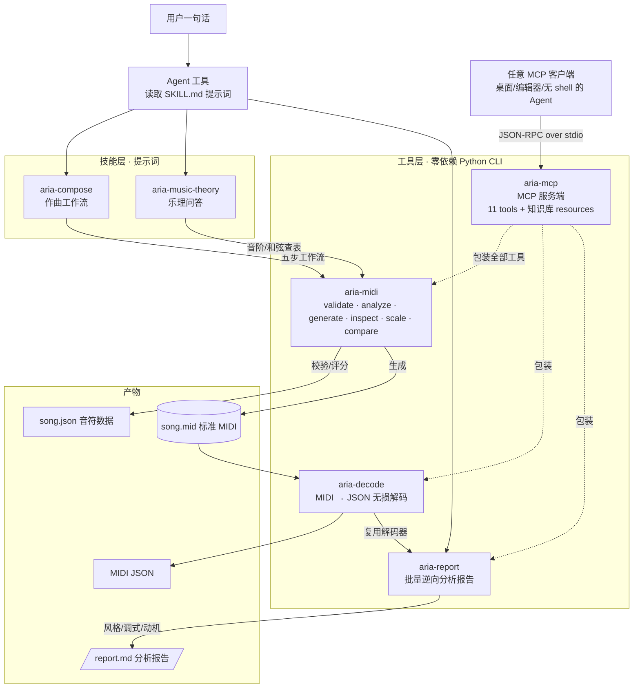

# Aria — 便携音乐技能包

> AI 音乐创作技能包：**提示词（Skills）+ 工具包（Toolkit）** 一体化封装。
> Headless 作曲：不依赖 Node 服务器、不调用 LLM API。

[简体中文](README.md) | [English](README.en.md)

## 特性

- **自然语言作曲**：说一句话，Agent 按五步工作流产出 `song.json` + 标准 MIDI 文件
- **零依赖执行层**：仅 Python 标准库（Python 3.8+），任何 Agent 可用 Bash 直接调用
- **JSON 进出 + 退出码契约**：`0 成功 / 1 数据错误 / 2 用法错误`，结果可编程判断
- **质量闭环**：`validate --strict` 强制 0 错误，`analyze` 0–10 评分 + 中文改进建议，不达标不放行
- **全流程离线**：音阶/和弦查表用内置 CLI 计算，不依赖网络与外部 API
- **联网增强**：风格未知/要真实案例时，用中英文模糊检索 2–3 轮，不指定网站，来源过质量门槛后才落入提示词
- **可移植**：`install.py` 一键部署到 `~/.agents`，供支持 skills 扫描的 Agent 工具自动发现

## 环境要求

- Python 3.8+（仅标准库，无需 pip 安装任何依赖）
- 平台：Windows / macOS / Linux（Windows 中文系统下音轨名默认 GBK 编码，与播放器/DAW 兼容）

## 内容

```
.agent/
├── AGENTS.md              # 跨工具接入门面（支持 AGENTS.md 的工具自动发现）
├── README.md              # 中文 README
├── README.en.md           # 英文 README
├── LICENSE                # MIT 开源许可
├── install.py             # 自安装器：部署到 ~/.agents 供 skills 扫描
├── examples/
│   └── midi/              # 真实 MIDI 案例（Deep House / Tropical / Lo-fi）
├── decode/                # 待拆解 MIDI 输入目录（aria-report 分析入口）
├── skills/
│   ├── aria-compose/       # 作曲工作流：自然语言 → song.json → MIDI（含模式库/规则/范例）
│   │   └── references/    #   composition-rules / pattern-library / melody-chord-writing / midi-schema / examples
│   └── aria-music-theory/  # 乐理问答：音阶/和弦/进行 + 5 大风格知识库（pop/EDM/jazz/tropical/techniques）
└── toolkits/
    ├── aria-midi/          # 零依赖 Python CLI：generate/validate/inspect/scale/analyze/compare
    │   ├── aria_midi.py    #   v1.2.0（analyze 新增乐句结构分析 structure_score）
    │   ├── README.md       #   CLI 完整文档
    │   ├── tests/          #   33 个自测用例（roundtrip/校验/编码/分析/结构）
    │   └── bin/aria-midi.cmd    # PATH 垫片
    ├── aria-decode/        # 零依赖 MIDI → JSON 无损解码器
    │   ├── aria_decode.py  #   v1.0.1，单文件 ~590 行
    │   ├── README.md       #   解码器完整文档
    │   ├── tests/          #   22 个用例 35 项断言
    │   └── bin/aria-decode.cmd  # PATH 垫片
    ├── aria-report/        # 零依赖 MIDI 批量逆向分析（风格识别 + 调式 + 动机报告）
    │   ├── aria_report.py  #   v1.0.0（依赖同级的 aria-decode）
    │   ├── README.md       #   完整文档（含分析维度与已知限制）
    │   ├── tests/          #   38 个用例 73 项断言
    │   └── bin/aria-report.cmd  # PATH 垫片
    └── aria-mcp/           # 零依赖 MCP 服务端（把能力开放给任意 MCP 客户端）
        ├── aria_mcp.py     #   v1.0.0，手写 stdio JSON-RPC 2.0
        ├── README.md       #   完整文档（含各客户端配置落点）
        ├── tests/          #   39 个用例 82 项断言
        └── bin/aria-mcp.cmd # PATH 垫片

> 每个 `bin/` 同时提供 Windows 的 `.cmd` 与 POSIX 的 `sh` 垫片（无扩展名、可执行位已设）。
```

## 架构



流程：用户一句话 → Agent 按技能提示词驱动 → 工具层零依赖 CLI 计算 → 产出 song.json 与标准 MIDI；`aria-decode` 可把任意 `.mid` 无损解码回 JSON 供逆向分析/质检，`aria-report` 在解码层之上批量产出风格/调式/动机报告。

**跨 Agent 适配**：`aria-mcp` 把上面三个工具连同知识库包装成 MCP 服务端，使**任何支持 MCP 的客户端**（含没有 shell、读不到提示词的 GUI Agent）都能调用 Aria 的全部能力，而不只是支持 skills 扫描或命令行执行的 Agent。

## 快速使用

```bash
# 1. 安装到 ~/.agents（供 skills 扫描类工具自动发现；幂等，可重复执行）
python install.py

# 2. 直接用 CLI（零安装）
python toolkits/aria-midi/aria_midi.py scale --root C4 --type major --list

# 3. 或加入 PATH 后用短命令
aria-midi generate --input song.json --output song.mid --bpm 120

# 4. 逆向解码 MIDI
aria-decode decode --input song.mid --output song.json

# 5. 批量拆解分析（把 .mid 放入 decode/ 目录后）
aria-report report --input decode/ --output report.md
```

## CLI 子命令速查

| 子命令 | 功能 | 退出码 |
|--------|------|--------|
| `validate --input song.json [--strict]` | 校验 schema/音域/力度/量化/重叠 | 0 通过 / 1 有错误 |
| `analyze --input song.json [--chords chords.json] [--key-root C4]` | 0–10 评分（技术分/音乐性分/结构分）+ 中文改进建议 | 0 |
| `generate --input song.json --output song.mid [--bpm 120]` | 生成标准 MIDI 文件（Type-1, TPQN=480） | 0 / 1 / 2 |
| `inspect --input song.mid` | 解析回读 .mid 自检 | 0 / 1 |
| `scale --root C4 --type major [--list/--chord/--snap/--suggest]` | 音阶/和弦计算查表（13 种音阶、14 种和弦） | 0 / 2 |
| `compare --input song.json --reference ref.mid` | 风格锚定：产出 vs 参考案例风格参数对比 | 0 / 1 / 2 |

所有子命令 JSON 进 JSON 出；`--input -` 支持从 stdin 读取；`aria-midi --version` 查看版本。

## MIDI → JSON 解码（aria-decode）

`aria-decode` 解决「拿到一个 `.mid` 后，想看清里面到底有什么」的问题：把任意 MIDI 无损解码为结构化 JSON，逆向分析、格式转换与生成后质检都能直接消费。

- **完整事件**：meta / CC / 弯音 / 歌词 / SysEx / 系统消息全部保留，不只提取音符
- **双时基**：PPQN 与 SMPTE（含 29.97 drop-frame）均支持
- **精确时间**：Tempo 变化按全局时间轴跨轨换算秒时间，音符含 `start_time` / `end_time`
- **可读映射**：附 GM 音色名（128 项）、标准 CC 控制器名、音高名（C4 等）

```bash
aria-decode decode --input song.mid                      # 完整解码输出到 stdout
aria-decode decode --input song.mid --output song.json   # 完整解码写入 JSON 文件
aria-decode decode --input song.mid --no-events          # 快速概览：头部+全局+音符
aria-decode decode --input song.mid --no-notes           # 只要事件明细
cat song.mid | aria-decode decode --input - > song.json  # stdin 管道
```

与 `aria-midi inspect`（有损，仅提取音符/音轨名/Tempo）不同，aria-decode 保留每一个事件。需要检查 Tempo 变化、CC/弯音/歌词、SysEx，或做生成后质检时，优先用 aria-decode。完整命令与输出结构见 `toolkits/aria-decode/README.md`。

## MIDI 批量逆向分析（aria-report）

`aria-report` 解决「拿到一个（或一批）人类编曲的 `.mid`，想看清它是什么风格、旋律动机怎么发展」的问题：扫描 `decode/` 目录，对每个文件做**风格识别 + 调式推测 + 旋律动机分析**，输出 Markdown 报告。

- **风格识别**：基于 BPM / 音色 / 调式 / 音域的启发式判断，输出 Top 3 候选 + 依据
- **调式推测**：由音高集合对 13 种音阶的覆盖率排序，主音频次打破平局
- **动机提取**：识别旋律轨重复的音程窗口，标注出现位置（小节/拍）与发展手法（原样重复 / 模进移调）

```bash
aria-report report --input decode/ --output report.md        # 批量分析整个目录
aria-report report --input decode/foo.mid                    # 只分析单个文件
aria-report report --input decode/ --format json             # JSON 输出，供程序化消费
```

用法：把 `.mid` 丢进 `decode/` → `aria-report report --input decode/` → 得到 `report.md`。完整说明见 `decode/README.md`。

## 跨 Agent 适配：MCP 服务端（aria-mcp）

上面三个工具都是命令行程序，隐含要求 Agent **能执行进程**。`aria-mcp` 把它们连同知识库包装成 **MCP（Model Context Protocol）服务端**，使任何支持 MCP 的客户端都能调用——包括没有 shell、也读不到提示词的 GUI 类 Agent。

```bash
python toolkits/aria-mcp/aria_mcp.py            # stdio 传输，由 MCP 客户端拉起
python toolkits/aria-mcp/aria_mcp.py --selftest # 自检
```

在客户端配置里注册（`mcpServers` 为通用键，各客户端文件名不同）：

```json
{
  "mcpServers": {
    "aria": {
      "command": "python",
      "args": ["/绝对路径/Aria_Skills/toolkits/aria-mcp/aria_mcp.py"]
    }
  }
}
```

暴露内容：

- **11 个 tools**：`scale_list` / `chord_tones` / `snap_pitches` / `suggest_scale` / `validate_song` / `analyze_song` / `generate_midi` / `inspect_midi` / `decode_midi` / `compare_style` / `report_midi`
- **18 个 resources**：`skills/` 下全部 Markdown，以 `aria://knowledge/<路径>` 供客户端**按需拉取**，避免把约 4.3 万 token 的知识库一次性灌进上下文

三个关键设计：**零依赖**（手写 stdio JSON-RPC 2.0，不引官方 SDK，保住「复制即用」）、**传内容不传路径**（MIDI 一律 base64 进出，适配客户端与服务端不共享文件系统的场景）、**`isError` 只表示工具没跑成**（校验查出错误是正常结果 `ok:false`，不是工具崩溃，否则 Agent 读不到报错详情）。

各客户端配置落点与完整说明见 `toolkits/aria-mcp/README.md`。

## 完整作曲流程（详见 skills/aria-compose/SKILL.md 五步工作流）

```bash
aria-midi validate --input song.json --strict   # 第 1 步：必须 0 errors
aria-midi analyze  --input song.json --chords chords.json   # 第 2 步：分数 ≥ 7
aria-midi generate --input song.json --output song.mid      # 第 3 步：生成 MIDI
aria-midi inspect  --input song.mid                         # 第 4 步：往返自检
```

示例输出（validate）：

```json
{
  "ok": true,
  "errors": [],
  "warnings": [],
  "stats": {"bpm": 120, "track_count": 2, "note_count": 20, "total_beats": 32.0, "pitch_min": 36, "pitch_max": 74}
}
```

## 技能使用方式

| 场景 | 用什么 |
|------|--------|
| 写/生成旋律、歌曲、MIDI、和弦进行 | 读 `skills/aria-compose/SKILL.md`，按五步工作流执行 |
| 乐理/编曲知识问答 | 读 `skills/aria-music-theory/SKILL.md` |
| 只调 CLI，不需要提示词 | 按 `toolkits/aria-midi/README.md` 直接调用 |

## 使用操作细节

### 1. 安装与自动发现

支持 skills 扫描的 Agent 工具，先在包根目录执行：

```bash
python install.py
```

`install.py` 是幂等的，可重复执行。部署结果：

```text
~/.agents/skills/aria-compose/SKILL.md
~/.agents/skills/aria-music-theory/SKILL.md
~/.agents/toolkits/aria-midi/aria_midi.py
~/.agents/toolkits/aria-decode/aria_decode.py
```

安装后验证：

```powershell
Test-Path "$HOME\.agents\skills\aria-compose\SKILL.md"
Test-Path "$HOME\.agents\toolkits\aria-midi\aria_midi.py"
```

若 Agent 没有自动扫描到技能，把上述 `SKILL.md` 的完整路径直接放进 Agent 上下文，按“显式加载”使用。

### 2. 显式加载（任何 Agent 都适用）

```text
写/生成音乐 -> 读 skills/aria-compose/SKILL.md
乐理/编曲问答 -> 读 skills/aria-music-theory/SKILL.md
需要完整 MIDI 事件 -> 读 toolkits/aria-decode/README.md
```

Agent 执行 CLI 时的定位顺序：

1. 若 PATH 已有 `aria-midi`：直接用 `aria-midi <子命令> [参数]`
2. 否则用包内相对路径：`python <技能包根目录>/toolkits/aria-midi/aria_midi.py <子命令> [参数]`
3. 不要用“猜路径”，先 `Get-ChildItem toolkits -Recurse -Filter aria_midi.py` 或 `find toolkits -name aria_midi.py` 确认实际位置

示例（当前包根目录）：

```powershell
python toolkits\aria-midi\aria_midi.py scale --root C4 --type major --list
python toolkits\aria-decode\aria_decode.py decode --input song.mid --no-events
```

### 3. 完整作曲操作序列

```bash
# 0. 确认运行环境
python --version

# 1. 用 scale 查表，不要心算音阶/和弦
python toolkits/aria-midi/aria_midi.py scale --root A4 --type minor --list
python toolkits/aria-midi/aria_midi.py scale --root C4 --type major --chord m7

# 2. 先写 chords.json，再写 song.json
#    schema 见 skills/aria-compose/references/midi-schema.md

# 3. 严格校验：必须 ok=true 且 errors=[]
python toolkits/aria-midi/aria_midi.py validate --input song.json --strict

# 4. 质量评分：score >= 7；低于 7 按 suggestions 修改后重跑
python toolkits/aria-midi/aria_midi.py analyze --input song.json --chords chords.json

# 5. 生成 MIDI
python toolkits/aria-midi/aria_midi.py generate --input song.json --output song.mid --bpm 120

# 6. 回读自检：核对音符数/BPM/时长
python toolkits/aria-midi/aria_midi.py inspect --input song.mid

# 7. 无损质检：用 aria-decode 检查 Tempo/CC/弯音等完整事件
python toolkits/aria-decode/aria_decode.py decode --input song.mid --output song.qa.json
```

每次修改 `song.json` 后必须重新执行 `validate --strict`，不能只改文件不校验。

### 4. stdin 与 stdout

`validate / analyze / generate` 支持 `--input -` 从 stdin 读 JSON；`aria-decode` 的 `--input -` 从 stdin 读 MIDI 文件。

```bash
cat song.json | python toolkits/aria-midi/aria_midi.py validate --input - --strict
cat song.mid | python toolkits/aria-decode/aria_decode.py decode --input - > song.json
```

`aria-decode` 不传 `--output` 时输出到 stdout，文本为 UTF-8。Windows 控制台若显示乱码，可设置 `PYTHONIOENCODING=utf-8` 再运行。

### 5. 退出码判断

| 退出码 | 含义 | 常见处理 |
|--------|------|----------|
| `0` | 成功 | 继续下一环节 |
| `1` | 数据错误 | 读 JSON 中的 `errors` / `warnings`，修正 song.json 后重跑 |
| `2` | 用法/IO 错误 | 检查参数拼写、输入文件路径、输出目录是否存在 |

### 6. 常见失败处理

| 现象 | 原因 | 处理 |
|------|------|------|
| `aria-midi` 不是内部或外部命令 | `toolkits/aria-midi/bin` 未加入 PATH | 改用完整 Python 路径调用，或把 `bin` 加入 PATH |
| `python` 找不到 | 系统未安装或未加入 PATH | 使用完整 Python 解释器路径，例如 Codex runtime 的 `python.exe` |
| `validate` 报 off grid | 音符不在 0.25 拍网格 | 把 `start_beat` / `duration` 改成 0.25 的整数倍 |
| `analyze` 分数低 | 强拍不在和弦音、力度平、无休止等 | 按 `suggestions` 中文建议逐条修改 |
| `inspect` 报 SMPTE 不支持 | `aria-midi inspect` 只支持 PPQN | 改用 `aria-decode decode` 查看完整时间轴 |

## 自测

```bash
python toolkits/aria-midi/tests/run_tests.py     # 33 个用例全绿
python toolkits/aria-decode/tests/run_tests.py   # 22 个用例 35 项断言全绿
python toolkits/aria-report/tests/run_tests.py   # 38 个用例 73 项断言全绿
python toolkits/aria-mcp/tests/run_tests.py      # 39 个用例 82 项断言全绿
```

## 常见问题

| 问题 | 解答 |
|------|------|
| 生成的 MIDI 音轨名在 Windows 播放器里乱码？ | `generate` 默认 `--name-encoding auto`，Windows 中文系统自动用 GBK；其他平台用 UTF-8，可用 `--name-encoding` 覆盖 |
| analyze 分数低怎么办？ | 按 suggestions 里的中文建议修改 song.json：强拍落和弦音、级进占比 ≥60%、力度弧线、节奏呼吸、时值多样 |
| 音符不在 0.25 网格上？ | `validate` 非 strict 只警告；加 `--strict` 则视为错误，start_beat/duration 需为 0.25 的整数倍 |
| 多轨作品 analyze 评分准吗？ | 默认只评旋律轨（平均音高最高的轨），避免伴奏轨污染；用 `--track` 指定、`--all-tracks` 合并全轨 |
| 爵士/琶音旋律被误判跳进过多？ | 加 `--style jazz/arpeggio/blues/edm/lofi` 豁免级进占比约束 |
| 修改技能内容不生效？ | 本包由 `skills-source/` 打包生成，改源文件后重新打包；勿直接改本包内容（install.py 除外） |

## 开源许可

本项目基于 **MIT License** 开源，详见 [LICENSE](LICENSE)。
Copyright (c) 2026 Mark7us

## 事实源

本目录（aria-* 谱系）即当前维护版本，直接在此修改。早期由 `D:\Document\AMR\AiMidi-Skills\skills-source\`（amr-* 谱系）打包演化而来，两者已分叉，勿回改旧工作区。
