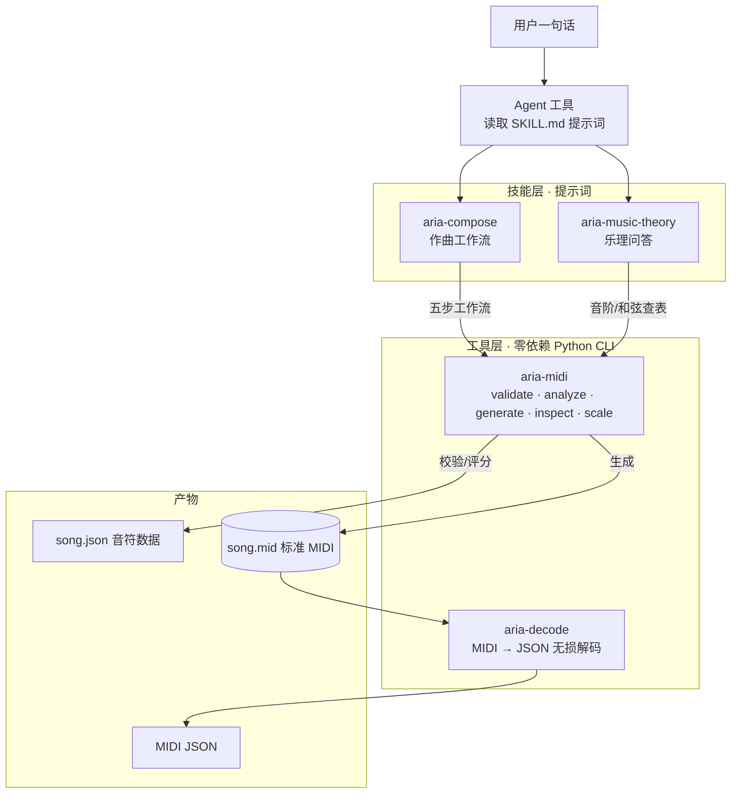

# Aria — 便携音乐技能包

> AI 音乐创作技能包：**提示词（Skills）+ 工具包（Toolkit）** 一体化封装。
> Headless 作曲：不依赖 Node 服务器、不调用 LLM API。

[简体中文](README.md) | [English](README.en.md)

## 特性

- **自然语言作曲**：说一句话，Agent 按五步工作流产出 `song.json` + 标准 MIDI 文件
- **零依赖执行层**：仅 Python 标准库（Python 3.8+），任何 Agent 可用 Bash 直接调用
- **JSON 进出 + 退出码契约**：`0 成功 / 1 数据错误 / 2 用法错误`，结果可编程判断
- **质量闭环**：`validate --strict` 强制 0 错误，`analyze` 0–10 评分 + 中文改进建议，不达标不放行
- **全流程离线**：音阶/和弦查表用内置 CLI 计算，不依赖网络与外部 API
- **可移植**：`install.py` 一键部署到 `~/.agents`，供支持 skills 扫描的 Agent 工具自动发现

## 环境要求

- Python 3.8+（仅标准库，无需 pip 安装任何依赖）
- 平台：Windows / macOS / Linux（Windows 中文系统下音轨名默认 GBK 编码，与播放器/DAW 兼容）

## 内容

```
.agent/
├── AGENTS.md              # 跨工具接入门面（支持 AGENTS.md 的工具自动发现）
├── README.md              # 中文 README
├── README.en.md           # 英文 README
├── LICENSE                # MIT 开源许可
├── install.py             # 自安装器：部署到 ~/.agents 供 skills 扫描
├── skills/
│   ├── aria-compose/       # 作曲工作流：自然语言 → song.json → MIDI（含模式库/规则/范例）
│   │   └── references/    #   composition-rules / pattern-library / midi-schema / examples
│   └── aria-music-theory/  # 乐理问答：音阶/和弦/进行 + 5 大风格知识库（pop/EDM/jazz/tropical/techniques）
└── toolkits/
    ├── aria-midi/          # 零依赖 Python CLI：generate/validate/inspect/scale/analyze
    │   ├── aria_midi.py    #   v1.1.0，单文件 ~865 行
    │   ├── README.md      #   CLI 完整文档
    │   ├── tests/         #   23 个自测用例（roundtrip/校验/编码/分析）
    │   └── bin/aria-midi.cmd   # PATH 垫片
    └── aria-decode/        # 零依赖 MIDI → JSON 无损解码器
        ├── aria_decode.py  #   v1.0.0，单文件 ~575 行
        ├── README.md      #   解码器完整文档
        ├── tests/         #   20 个用例 32 项断言
        └── bin/aria-decode.cmd  # PATH 垫片
```

## 架构



流程：用户一句话 → Agent 按技能提示词驱动 → 工具层零依赖 CLI 计算 → 产出 song.json 与标准 MIDI；`aria-decode` 可把任意 `.mid` 无损解码回 JSON 供逆向分析/质检。

## 快速使用

```bash
# 1. 安装到 ~/.agents（供 skills 扫描类工具自动发现；幂等，可重复执行）
python install.py

# 2. 直接用 CLI（零安装）
python toolkits/aria-midi/aria_midi.py scale --root C4 --type major --list

# 3. 或加入 PATH 后用短命令
aria-midi generate --input song.json --output song.mid --bpm 120
```

## CLI 子命令速查

| 子命令 | 功能 | 退出码 |
|--------|------|--------|
| `validate --input song.json [--strict]` | 校验 schema/音域/力度/量化/重叠 | 0 通过 / 1 有错误 |
| `analyze --input song.json [--chords chords.json] [--key-root C4]` | 0–10 评分 + 中文改进建议 | 0 |
| `generate --input song.json --output song.mid [--bpm 120]` | 生成标准 MIDI 文件（Type-1, TPQN=480） | 0 / 1 / 2 |
| `inspect --input song.mid` | 解析回读 .mid 自检 | 0 / 1 |
| `scale --root C4 --type major [--list/--chord/--snap/--suggest]` | 音阶/和弦计算查表（13 种音阶、14 种和弦） | 0 / 2 |

所有子命令 JSON 进 JSON 出；`--input -` 支持从 stdin 读取；`aria-midi --version` 查看版本。

## MIDI → JSON 解码（aria-decode）

无损解码任意 `.mid`：覆盖全部事件类型（meta/CC/弯音/歌词/SysEx/系统消息）、PPQN 与 SMPTE 双时基、Tempo 变化精确换算秒时间，附 GM 音色名 / CC 控制器名 / 音高名映射。

```bash
aria-decode decode --input song.mid --output song.json   # 完整解码（默认）
aria-decode decode --input song.mid --no-events          # 快速概览：头部+全局+音符
```

与 `aria-midi inspect`（有损，仅提取音符/音轨名/Tempo）不同，aria-decode 保留每一个事件，适合逆向分析、格式转换与质检。详见 `toolkits/aria-decode/README.md`。

## 完整作曲流程（详见 skills/aria-compose/SKILL.md 五步工作流）

```bash
aria-midi validate --input song.json --strict   # 第 1 步：必须 0 errors
aria-midi analyze  --input song.json --chords chords.json   # 第 2 步：分数 ≥ 7
aria-midi generate --input song.json --output song.mid      # 第 3 步：生成 MIDI
aria-midi inspect  --input song.mid                         # 第 4 步：往返自检
```

示例输出（validate）：

```json
{
  "ok": true,
  "errors": [],
  "warnings": [],
  "stats": {"bpm": 120, "track_count": 2, "note_count": 20, "total_beats": 32.0, "pitch_min": 36, "pitch_max": 74}
}
```

## 技能使用方式

| 场景 | 用什么 |
|------|--------|
| 写/生成旋律、歌曲、MIDI、和弦进行 | 读 `skills/aria-compose/SKILL.md`，按五步工作流执行 |
| 乐理/编曲知识问答 | 读 `skills/aria-music-theory/SKILL.md` |
| 只调 CLI，不需要提示词 | 按 `toolkits/aria-midi/README.md` 直接调用 |

## 自测

```bash
python toolkits/aria-midi/tests/run_tests.py    # 23 个用例全绿
python toolkits/aria-decode/tests/run_tests.py  # 20 个用例 32 项断言全绿
```

## 常见问题

| 问题 | 解答 |
|------|------|
| 生成的 MIDI 音轨名在 Windows 播放器里乱码？ | `generate` 默认 `--name-encoding auto`，Windows 中文系统自动用 GBK；其他平台用 UTF-8，可用 `--name-encoding` 覆盖 |
| analyze 分数低怎么办？ | 按 suggestions 里的中文建议修改 song.json：强拍落和弦音、力度弧线、节奏呼吸、时值多样 |
| 音符不在 0.25 网格上？ | `validate` 非 strict 只警告；加 `--strict` 则视为错误，start_beat/duration 需为 0.25 的整数倍 |
| 多轨作品 analyze 评分不准？ | 已知限制：analyze 将所有音轨合并统计，会包含伴奏轨，请以旋律轨为主参考 |
| 修改技能内容不生效？ | 本包由 `skills-source/` 打包生成，改源文件后重新打包；勿直接改本包内容（install.py 除外） |

## 开源许可

本项目基于 **MIT License** 开源，详见 [LICENSE](LICENSE)。
Copyright (c) 2026 Mark7us

## 事实源

本包由 `D:\Document\AMR\Aria-Skills\skills-source\` 打包生成（`package_to_agent.py`）。
修改技能请回工作区改源文件后重新打包。
